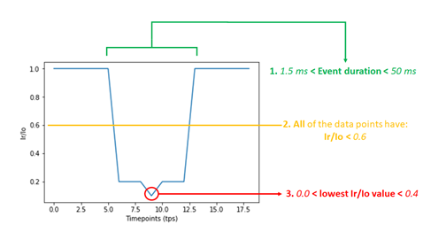

# `osbp_detect`

`osbp_detect` allows for the detection of single unassisted oligonucleotide translocation events from ONT bulk FAST5 files. 

While the pipeline has been developed with the objective to detect and report translocations of Osmium-labelled oligonucleotides using Oxford Nanopore devices, the algorithm in its current form can also be used for the detection of any small molecule traversing any nanopore.

## Contributors

- Anastassia Kanavarioti (tessi.kanavarioti@gmail.com)
- Albert Kang (swk30@cam.ac.uk) 

## How it works

Let *y* be an ordered sequence of real values representing a typical time-series obtained from a Nanopore device. 

We initially categorise regions of *y* into one of two states: current from an open channel, *Io*, where nothing is passing through the Nanopore, and the residual current when some translocation event is taking place, *Ir*. 

The *Io* is first established by taking the median of the signals between a pre-defined lower and upper bound of the predicted open current.

Generally, the sharp transitions between the *Io* and *Ir* states permit the use of a rule-based parser to define the single translocation event of a molecule, where various thresholds can be hand-crafted to a particular application. 

Our simplistic approach makes use of three conditions whose key parameters are outlined in the figure below:



## Run GUI

```python3 gui.py```

## CLI parameters

```
usage: run.py [-h] -i I [-r R] [-s S] [-b B]

Detect events corresponding to short, single miRNA translocations

optional arguments:
  -h, --help  show this help message and exit
  -i I        Input FAST5
  -r R        Range of channels to analyse - format: {}-{}
  -s S        Specific channels to analyse - channel numbers separated by
              commas
  -b B        Blacklisted channels - channel numbers separated by commas
```

## Example CLI

```python3 run.py -i ../../Datasets/minion/20190718_miRNA21_40min_200mV.fast5 > 20190718_miRNA21_40min_200mV.tsv &```

## Reference

Sultan, M. and Kanavarioti, A., 2019. Nanopore device-based fingerprinting of RNA oligos and microRNAs enhanced with an Osmium tag. Scientific reports, 9(1), pp.1-18. https://www.nature.com/articles/s41598-019-50459-8

